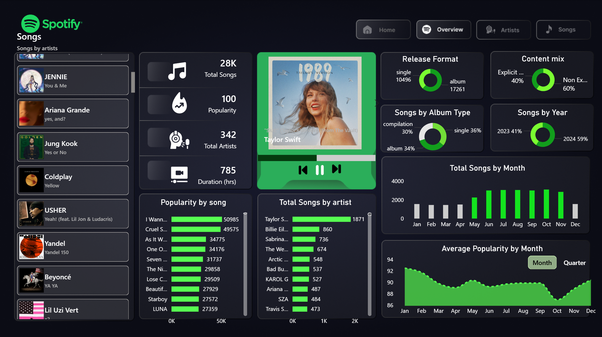
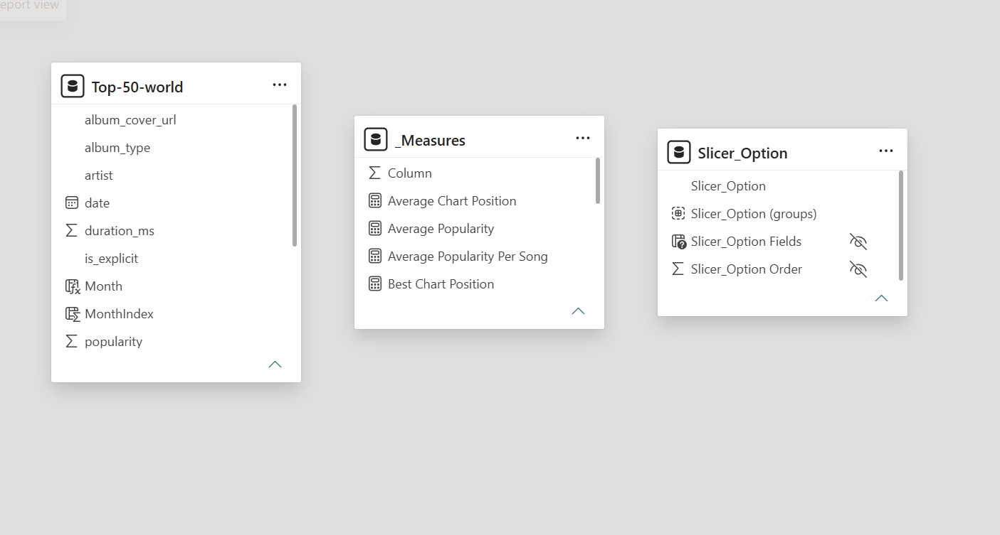

# Spotify-Streaming-Analytics
Spotify streaming analytics canvas built in Power BI using advanced DAX queries, single-table modeling, and dynamic UI/UX design.
# Spotify Streaming Analytics Canvas (Power BI)

## Project Overview

The **Spotify Streaming Analytics Canvas** is an interactive, single-page executive dashboard designed to **transform high-volume digital music streaming data into actionable content and release strategies**. 

This dashboard allows music executives, record labels, and catalog managers to **instantly track listener engagement, analyze song characteristics, and monitor artist performance**, enabling **data-driven decisions** that can optimize marketing spend, maximize streaming revenue, and predict seasonal hits.

Key highlights include:
- **Trend & Seasonality Analysis**: Visualize daily, monthly, and quarterly streaming trends to optimize release windows.
- **Content Mix Insights**: Evaluate the distribution of explicit vs. clean tracks and breakdown music formats (Singles vs. Albums).
- **Dynamic Spotlight Engine**: A central, app-like streaming player interface that showcases full metadata and album covers based on user interaction.
- **Advanced Interactivity**: Integrated dynamic slicers and customized period toggles to seamlessly filter data without breaking backend model relationships.

This project demonstrates **end-to-end business intelligence engineering**: from deep data cleaning and chronological indexing in Power Query to coding advanced metric calculations using programmatic DAX syntax in the native DAX Query View.

### Dashboard Overview

The main dashboard displays critical streaming KPIs and high-end visualizations, allowing stakeholders to **interactively explore market performance, consumer preferences, and catalog metrics**.

The dashboard enables users to:
- Monitor core streaming metrics: Total Songs, Popularity Scores, Unique Artists, and Track Durations.
- Discover seasonal consumption trends across months and quarters.
- Compare release types (Singles, Albums, Compilations) and content classifications.
- Deep-dive into specific artists or tracks using an integrated interactive list.

All visuals are fully responsive and interconnected, providing a fluid, modern software application experience.


*Interactive executive canvas featuring global streaming metrics, a dynamic track player spotlight, and multi-dimensional trend charts.*

## Dashboard Access

- **Power BI Desktop File (.pbix):** Uploaded directly to this repository (download to explore full schema and calculations)
- **Project Walkthrough Video:** [Watch the Presentation Video Here](YOUR_LINKEDIN_VIDEO_LINK_HERE)

> Note: GitHub does not support previewing interactive Power BI files (.pbix). Please download the file locally to explore the full dashboard interactivity and backend architecture.


### Architecture & Calculations

Behind the visual canvas, the project relies on strong data engineering and programmatic logic to ensure data integrity and zero-computation errors during refreshes:


*Optimized backend schema showcasing an isolated Calculated Measures table and a disconnected parameter Slicer table.*

#### Programmatic Semantic & Query Evaluation
Instead of standard point-and-click fields, all core business logic was handled programmatically. Below is the complete enterprise script executed in the native **DAX Query View** using advanced `DEFINE`, `CALCULATE`, and `SUMMARIZECOLUMNS` architecture to audit and output the entire metrics matrix in a single execution layer:

```dax
DEFINE

MEASURE 'Top-50-world'[Total Songs] =
COUNTROWS('Top-50-world')

MEASURE 'Top-50-world'[Total Artists] =
DISTINCTCOUNT('Top-50-world'[artist])

MEASURE 'Top-50-world'[Average Popularity] =
AVERAGE('Top-50-world'[popularity])

MEASURE 'Top-50-world'[Maximum Popularity] =
MAX('Top-50-world'[popularity])

MEASURE 'Top-50-world'[Minimum Popularity] =
MIN('Top-50-world'[popularity])

MEASURE 'Top-50-world'[Best Chart Position] =
MIN('Top-50-world'[position])

MEASURE 'Top-50-world'[Worst Chart Position] =
MAX('Top-50-world'[position])

MEASURE 'Top-50-world'[Average Chart Position] =
AVERAGE('Top-50-world'[position])

MEASURE 'Top-50-world'[Total Explicit Songs] =
CALCULATE(
    COUNTROWS('Top-50-world'),
    'Top-50-world'[is_explicit] = TRUE()
)

MEASURE 'Top-50-world'[Total Non Explicit Songs] =
CALCULATE(
    COUNTROWS('Top-50-world'),
    'Top-50-world'[is_explicit] = FALSE()
)

MEASURE 'Top-50-world'[Explicit Song Percentage] =
DIVIDE(
    [Total Explicit Songs],
    [Total Songs]
) * 100

MEASURE 'Top-50-world'[Songs Above Average Popularity] =
CALCULATE(
    COUNTROWS('Top-50-world'),
    FILTER(
        'Top-50-world',
        'Top-50-world'[popularity] > [Average Popularity]
    )
)

MEASURE 'Top-50-world'[Popularity Range] =
[Maximum Popularity] - [Minimum Popularity]

MEASURE 'Top-50-world'[Songs Per Artist] =
DIVIDE(
    [Total Songs],
    [Total Artists]
)

MEASURE 'Top-50-world'[Average Popularity Per Song] =
DIVIDE(
    SUM('Top-50-world'[popularity]),
    [Total Songs]
)

EVALUATE

SUMMARIZECOLUMNS(
    "Total Songs", [Total Songs],
    "Total Artists", [Total Artists],
    "Average Popularity", [Average Popularity],
    "Maximum Popularity", [Maximum Popularity],
    "Minimum Popularity", [Minimum Popularity],
    "Best Chart Position", [Best Chart Position],
    "Worst Chart Position", [Worst Chart Position],
    "Average Chart Position", [Average Chart Position],
    "Total Explicit Songs", [Total Explicit Songs],
    "Total Non Explicit Songs", [Total Non Explicit Songs],
    "Explicit Song Percentage", [Explicit Song Percentage],
    "Songs Above Average Popularity", [Songs Above Average Popularity],
    "Popularity Range", [Popularity Range],
    "Songs Per Artist", [Songs Per Artist],
    "Average Popularity Per Song", [Average Popularity Per Song]
)
```
## Business Problem
Managing a massive global music catalog involves handling thousands of active tracks daily. With such a high volume of data, it becomes highly challenging for streaming platforms and label executives to:

- Efficiently track overall popularity trends and track lifecycles.
- Pinpoint the exact seasonal periods where listener engagement peaks for maximum impact.
- Balance content distributions (such as explicit vs. clean mixes) to match global audience standards.
- Drill down instantly from high-level global metrics to individual artist performances without navigating cluttered sub-menus.

Without an advanced, centralized business intelligence tool, critical trends remain buried in raw relational data rows, slowing down key media strategy decisions.

## Objectives

The main goals of this project were to:

- **Create an Executive View:** Build a single, high-end dashboard where managers can track music performance by both months and quarters in one look.
- **Engineer a Live Player Spotlight:** Design a responsive, app-like center card that instantly changes to show the correct album cover and metrics the moment an artist is clicked.
- **Find the Best Release Windows:** Use historical time data to isolate the exact weeks and months when listener engagement spikes, helping labels plan high-budget music launches.
- **Optimize Backend Performance:** Structure the data tables cleanly so that filters work instantly without lagging or slowing down the dashboard.
- **Code Safe Business Metrics:** Write custom, error-free DAX formulas to calculate advanced metrics (like explicit song percentages) without risking system errors during updates.
  
## Key Performance Indicators (KPIs)
The dashboard tracks the following foundational metrics to deliver an instantaneous performance overview:

- **Total Songs** – Continuous count of active tracks within the monitored dataset.
- **Popularity Index** – A normalized score out of 100 measuring listener engagement and streaming volume.
- **Total Artists** – Count of distinct artists contributing to the streaming data pool.
- **Duration Metric** – Aggregated playtimes useful for assessing user retention and streaming consumption lengths.

These metrics are structured inside a prominent vertical summary panel on the left-center of the canvas, guiding the executive's eye instantly to the macro numbers.

## 📂 Dataset Description
The dataset used in this project covers global streaming metrics, tracking granular attributes including unique track IDs, artist names, position rankings, normalized popularity scores, durations (ms), release timelines, album types, explicit content tags, and direct web URLs for official album cover art.

This dataset was utilized as a rigorous, independent learning exercise to master advanced data modeling, data types, semantic layer organization, and dynamic visual interface design in Power BI.

## ⚠️ Disclaimer
This project is created strictly for educational and portfolio demonstration purposes. The dataset, dashboard, and visuals are independent projects and are not officially affiliated with, sponsored by, or endorsed by Spotify.

## 🛠 Tools & Techniques Used
- **Microsoft Power BI Desktop** – Core dashboard design, visual layout, and interface construction.
- **Power Query (M Language)** – Data cleaning, data type casting, and custom column engineering.
- **DAX (Data Analysis Expressions)** – Programmatic writing of complex conditional metrics in the native DAX Query View.
- **Chronological Index Mapping** – Engineering a dedicated `MonthIndex` column to force timeline charts to sort logically (Jan, Feb, Mar...) rather than alphabetically.
- **Disconnected Parameters** – Building isolated helper tables to handle dynamic front-end text and chart toggles (`Month` vs. `Quarter`).

## Key Learnings
- Mastered the ability to turn thousands of unstructured streaming records into an enterprise-grade corporate analytics interface.
- Gained hands-on experience structuring clear visual hierarchies using customized dark modes inspired by modern UI/UX design tools (Figma).
- Developed strong data modeling hygiene by separating raw data tables from custom calculated formula folders (Measures Tables).
- Learned to write advanced, safe semantic formulas using `CALCULATE`, `FILTER`, and `DIVIDE` to prevent data engine crash loops.

## Conclusion
This project successfully demonstrates the power of business intelligence within the Media & Entertainment analytics domain, bridging the gap between raw backend numbers and sleek, executive-level decision systems.
